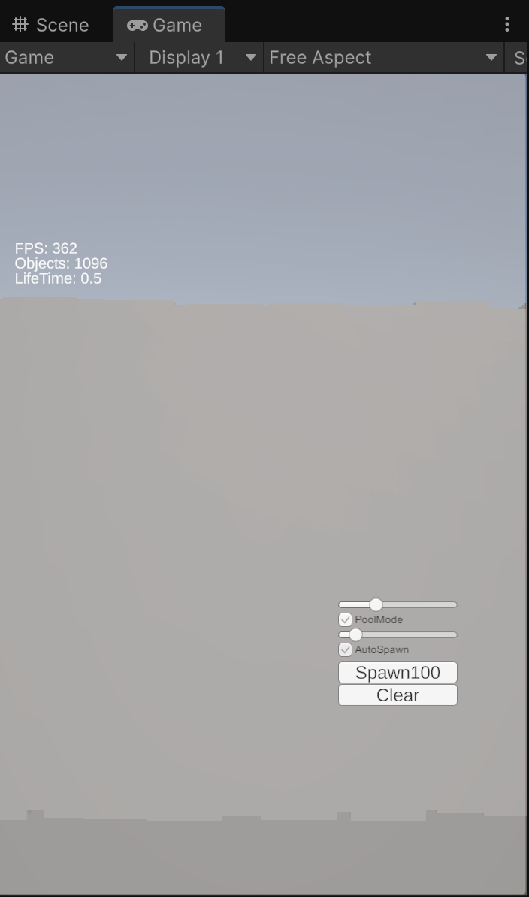
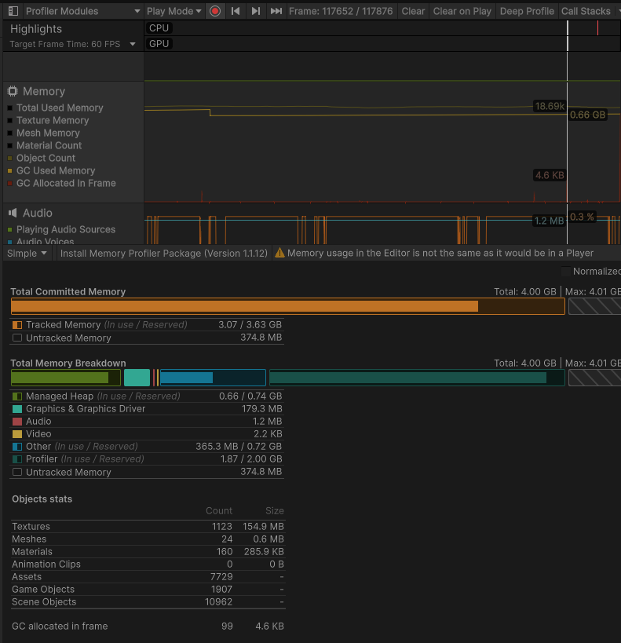
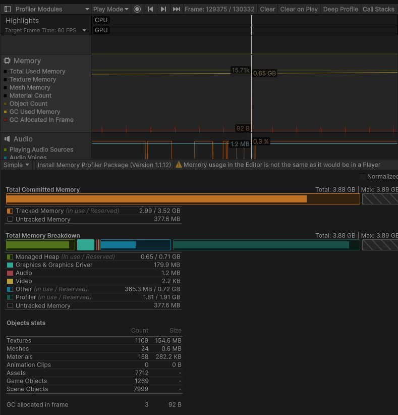

# Unity Stress Lab

Unity 환경에서 `Instantiate/Destroy` 방식과 `Object Pool` 방식을 비교 분석하기 위한 성능 테스트 프로젝트입니다.

단순히 오브젝트를 생성하는 데 그치지 않고, 런타임 중 발생하는 메모리 할당과 가비지 컬렉션 동작을 계측하여 성능 차이를 정량적으로 측정하는 것을 목표로 했습니다.

---

## 프로젝트 개요

- Unity 기반 성능 테스트 샌드박스
- UGUI 기반 실시간 성능 HUD 제공
- Destroy / Pool 생성 방식 전환 가능
- Spawn Rate 및 Lifetime 실시간 조절
- Unity Profiler를 활용한 GC 분석

---

## 개발 환경

- Unity 6
- Universal Render Pipeline (URP)
- C#
- UGUI
- Git / GitHub

---

## 주요 기능

### 오브젝트 생성

- 수동 생성 버튼
- 자동 생성(Auto Spawn)
- Spawn Rate 조절

### 오브젝트 제거

- Lifetime 기반 자동 제거
- 전체 제거(Clear)

### 생성 방식 비교

- Instantiate / Destroy
- Object Pool

### 실시간 성능 모니터링

- FPS
- 활성 오브젝트 수
- Spawn Rate
- Lifetime

---

## 프로젝트 구조

```text
Assets
├── Scripts
│   ├── Pooling
│   │   ├── IPoolable.cs
│   │   ├── ObjectPool.cs
│   │   └── PoolableCube.cs
│   ├── Spawn
│   │   ├── SpawnMode.cs
│   │   └── Spawner.cs
│   └── UI
│       └── StatsUI.cs
├── Prefabs
├── Scenes
└── UI
```

---

## Object Pool 설계

`IPoolable` 인터페이스를 통해 풀에 종속되지 않는 구조를 설계했습니다.

```csharp
public interface IPoolable
{
    void OnSpawn();
    void OnDespawn();
}
```

제네릭 기반 `ObjectPool<T>`를 구현하여 다양한 오브젝트에 재사용할 수 있도록 구성했습니다.

```csharp
public class ObjectPool<T>
    where T : Component, IPoolable
```

---

## 테스트 환경

### 테스트 1

- Spawn Rate: 100/sec
- Lifetime: 3 sec
- 테스트 시간: 30 sec

예상 활성 오브젝트 수

```text
100 × 3 = 300
```

### 테스트 2

- Spawn Rate: 2000/sec
- Lifetime: 0.5 sec
- 테스트 시간: 60 sec

예상 활성 오브젝트 수

```text
2000 × 0.5 = 1000
```

---

## 성능 측정 항목

Unity Profiler를 사용하여 다음 항목을 측정했습니다.

- GC Allocated In Frame
- GC Allocation Count
- GarbageCollector.CollectIncremental 호출 횟수
- Managed Heap
- Total Committed Memory
- Frame Time

---

## 측정 결과

### 테스트 1 (Spawn Rate: 100/sec, Lifetime: 3 sec)

| 항목 | Destroy | Pool | 개선율 |
|------|---------:|-----:|--------:|
| GC Allocated In Frame | 4.6 KB | 92 B | -98% |
| GC Allocation Count | 99 | 3 | -97% |
| GarbageCollector.CollectIncremental 호출 횟수 | 4회 | 1회 | -75% |

### 테스트 2 (Spawn Rate: 2000/sec, Lifetime: 0.5 sec)

| 항목 | Destroy | Pool |
|------|---------:|-----:|
| GarbageCollector.CollectIncremental 호출 횟수 | 3회 | 2회 |

---

## 분석

Object Pool 적용 후 프레임당 메모리 할당량과 메모리 할당 횟수가 크게 감소했습니다.

특히 다음 수치가 의미 있는 결과를 보여주었습니다.

- GC Allocated In Frame: `4.6 KB → 92 B`
- GC Allocation Count: `99 → 3`

Incremental GC 환경에서는 GC 호출 횟수 차이가 크게 나타나지 않았지만, 런타임 중 발생하는 메모리 할당 자체를 줄임으로써 GC 부담을 낮출 수 있음을 확인했습니다.

Object Pool은 평균 FPS 향상보다 다음 항목에서 효과가 더 크게 나타났습니다.

- 메모리 할당 감소
- GC 호출 빈도 감소
- 프레임 타임 안정성 향상
- 장시간 플레이 시 성능 유지

---

## 배운 점

- Object Pool의 핵심 목적은 FPS 향상이 아닌 GC 비용 감소에 있다.
- Incremental GC 환경에서는 GC 호출 횟수보다 메모리 할당 패턴이 중요하다.
- Unity Profiler를 활용해 정량적인 성능 분석이 가능하다.
- 제네릭과 인터페이스를 활용해 확장 가능한 풀링 시스템을 설계할 수 있다.

---

## 향후 개선 계획

- Strategy Pattern 기반 Spawn 구조 리팩토링
- CSV 기반 벤치마크 결과 저장
- Frame Time 그래프 추가
- Addressables 연동
- Unity Jobs/ECS 버전 비교
- 모바일 디바이스 실측 테스트

---

## 스크린샷







---

## 실행 방법

```bash
git clone https://github.com/asher2red/UnityStressLab.git
```

Unity Hub에서 프로젝트를 열고 `StressTestScene` 씬을 실행합니다.

---

## Repository

https://github.com/asher2red/UnityStressLab